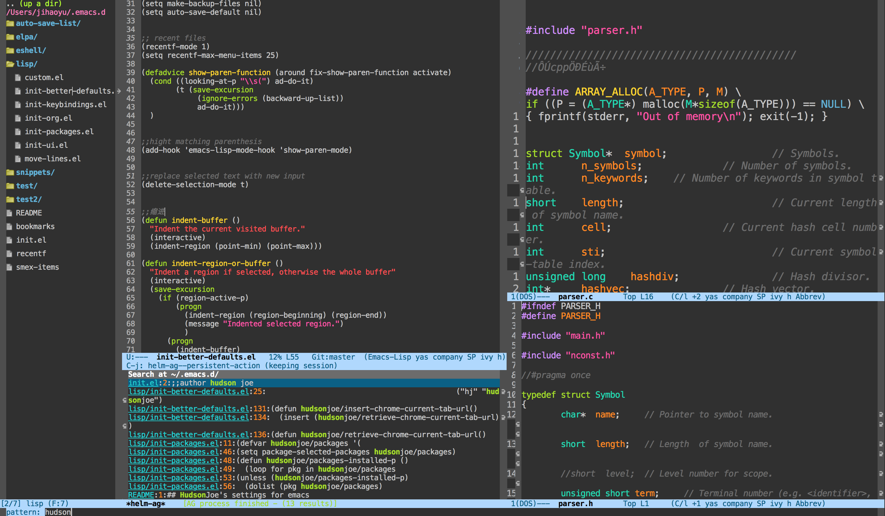
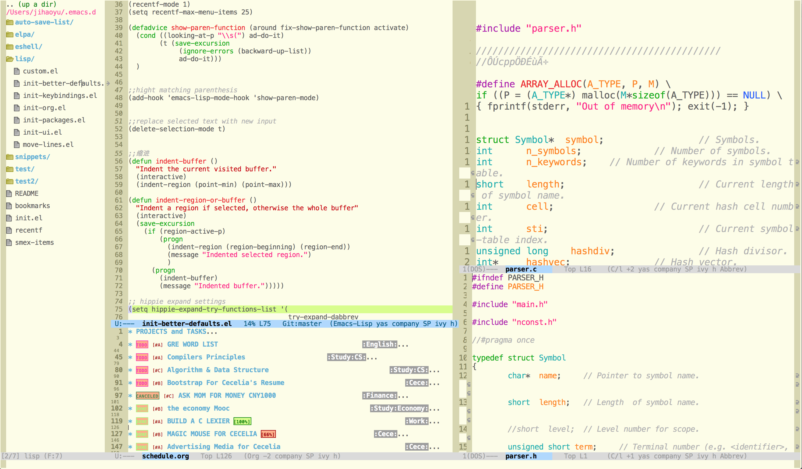
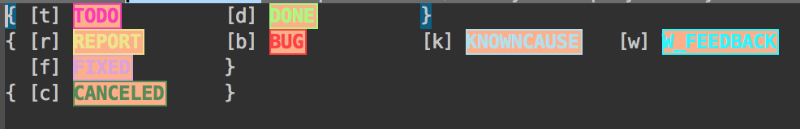
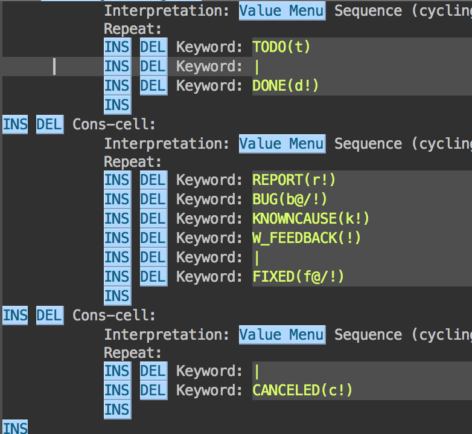

# joemacs
HudsonJoe's personal emacs configuration 
Screen Shots Atom One Dark Theme

Screen Shots (Using [moe-theme](https://github.com/kuanyui/moe-theme.el))



**Table of Contents**
- [Installation](#installation)
    - [Cautions and Prerequisites](#cautions-and-prerequisites)
    - [Quick Install](#quick-install-with-git)
         - [For Mac or Linux Users](#for-mac-or-linux-users)
         - [For Windows Users](#for-windows-users)
    - [Manually Install](#manually-install)
    - [Dependencies](#dependencies)
- [Packages and Usage](#packages-and-usage)
    - [Included Packages](#included-packages) 
    - [Existing Keybindings](#existing-keybindings)
         - [1. Functionalities](#1-functionalities)
         - [2. Window Move](#2-window-move)
         - [3. Org Mode](#3-org-mode)
         - [4. Editing](#4-editing)
- [File Tree](#file-tree)
- [Appendix](#appendix)
    - [Files containing with-eval-after-load](#files-containing-witn-eval-after-load)
    - [Replacing Example](#replacing-example)
 
 

## Installation
### Cautions and Prerequisites
- First, you gonna need an [Emacs](http://www.gnu.org/software/emacs/emacs.html), or there is [another way](https://emacsformacosx.com) to install it for Mac users.
- Your Emacs Version must be NO LOWER THAN 24.4, for there are many uses of 'with-eval-after-load'. However, if you are so determined to use it with some early versions of emacs, make sure that you get rid of all 'with-eval-after-load' functions, and replace them with (require 'package-name). All files containing 'with-eval-after-load' and examples to replace them will be given in [Appendix](#appendix).

- If you are using Windows, probably the [neotree](https://github.com/jaypei/emacs-neotree) package could not work right.
- Do customize the codes in init-org.el before you use org-agenda and org-capture functions.

### Quick Install with Git
#### For Mac or Linux Users
```
git clone https://github.com/Sort-Care/joemacs ~/.emacs.d
```
#### For Windows Users
If you are using windows [see here](http://www.gnu.org/software/emacs/manual/html_node/efaq-w32/Location-of-init-file.html). 
Or, [Windows用户配置的中文说明](http://www.cnblogs.com/FelixLee/archive/2011/01/21/2412620.html)
After setting the **"[home-path]"** in Windows, use the similar command to install it:
```
git clone https://github.com/Sort-Care/joemacs [home-path]/.emacs.d
```

### Manually Install
If you don't want to use git, try install joemacs manually:
- create folder .emacs.d under your home path(~). 
- copy init.el and lisp folder to your .emacs.d folder.
- restart your emacs, it will install all packages needed from the internet.

### Dependencies
- helm-ag: to make helm-ag work, you need to install [the silver searcher](https://github.com/ggreer/the_silver_searcher)

## Packages and Usage
### Included packages
```
			     ;;---------------- Packages for special file modes ----------
			     js2-mode
			     bison-mode
			     web-mode

			     
			     ;;----------- Packages providing awesome functionalities ---------- 
			     company
			     swiper
			     counsel
			     popwin
			     reveal-in-osx-finder
			     org-pomodoro
			     helm-ag
			     yasnippet
			     auto-yasnippet
			     neotree
			     exec-path-from-shell
			     
			     
			     ;;---------------- Packages for edit convenience ---------- 
			     hungry-delete
			     smartparens
			     expand-region
			     iedit

			     
			     ;;-------------------------- themes ---------- 
			     monokai-theme
			     moe-theme	   
```

### Existing Keybindings

#### 1. Functionalities
| File and Command Functions       | Key Bindings           |
| ------------- |:-------------:|
| Open Recent Files   | C-x C-r |
| Find Function      | C-h C-f      |
| Find Variable | C-h C-v      |
|Find Function on key|C-h C-k|
|Open [Swiper](https://github.com/abo-abo/swiper)| C-s |
|ivy-resume|C-c C-r|
|Open counsel M-x|M-x|
|Find File|C-x C-f|
|Counsel Describe Function|C-h f|
|Counsel Describe Variable|C-h v|
|Counsel Git Search| C-c p f|
|Counsel Ag Search| C-c p a|
|Counsel Locate Word| C-c c l|
|[Reveal File in Finder (Mac OS X)](https://github.com/kaz-yos/reveal-in-osx-finder)|C-c z|
|[Helm-ag](https://github.com/syohex/emacs-helm-ag) Search Project Root|C-c p s|
|Open File Tree ([neotree](https://github.com/jaypei/emacs-neotree))|f8|

#### 2. Window Move
Caution: Note that if you are using systems **other than Mac**, you need to redefine these window move keys for the C-S key settings conflict with some cursor selecting functions.

|Window Move| Key Bindings|
|---|:---:|
|Move Focusing Window ||
|--------- window up|C-c w p|
|--------- window down|C-c w n|
|--------- window left|C-c w b|
|--------- window right|C-c w f|


#### 3. Org Mode
I added some TODO List states to org mode, 

you can totally customize them by:
```
M-x customize-group [RET] org-todo  
```
Then find the group named "Org Todo Keywords". 


About arguments in the parentheses:
>Since it is normally too much to record a note for every state, Org mode expects configuration on a per-keyword basis for this. This is achieved by adding special markers ‘!’ (for a timestamp) or ‘@’ (for a note with timestamp) in parentheses after each keyword.

Before using Open Org Agenda shortcut, you need to appoint a folder:
```
 (setq org-agenda-files '("~/org"))
```
Put this in init-org.el, after the (require 'org) or between the parentheses of with-eval-after-load function, like this:
```
(with-eval-after-load 'org
  (setq org-agenda-files '("~/org"))
)
```

|Org Mode| Key Bindings|
| --------- |:--------------:|
|Open Org Agenda ( need customizing before being used)|C-c a|
|Org Capture ( need customizing before being used)|C-c r|
|Org-pomodoro Start a Timer|C-c o p|


#### 4. Editing
|Editing Shortcuts| Key Bindings|
| --------- |:--------------:|
|Indent Buffer or Region|C-M-\\|
|Hippie Expand Completion|s-/|
|[Expand Region Select](https://github.com/magnars/expand-region.el)|C-=|
|Enter [iedit](https://github.com/victorhge/iedit) Mode|M-s e|
|Selecting Candidates of [Company](https://github.com/company-mode/company-mode) Completion||
|------- Next One|C-n|
|------- Previous One|C-p|
|[Auto yasnippet](https://github.com/abo-abo/auto-yasnippet) Create| C-c s c|
|Auto yasnippet Expand| C-c s e|
|[Move Line or Region](https://github.com/targzeta/move-lines)||
|------- Up|M-p|
|------- Down|M-n|


## File Tree
.emacs.d<br>
|-- init.el<br>
|-- lisp<br>
&nbsp;&nbsp;&nbsp;&nbsp;&nbsp;&nbsp;&nbsp;|--- init-packages.el<br>
&nbsp;&nbsp;&nbsp;&nbsp;&nbsp;&nbsp;&nbsp;|--- init-ui.el<br>
&nbsp;&nbsp;&nbsp;&nbsp;&nbsp;&nbsp;&nbsp;|--- init-better-defaults.el<br>
&nbsp;&nbsp;&nbsp;&nbsp;&nbsp;&nbsp;&nbsp;|--- init-keybindings.el<br>
&nbsp;&nbsp;&nbsp;&nbsp;&nbsp;&nbsp;&nbsp;|--- init-org.el<br>
&nbsp;&nbsp;&nbsp;&nbsp;&nbsp;&nbsp;&nbsp;|--- custom.el<br>
&nbsp;&nbsp;&nbsp;&nbsp;&nbsp;&nbsp;&nbsp;|--- move-lines.el<br>

## Appendix
### Files containing with-eval-after-load
1. init-better-defaults.el: line 105: (with-eval-after-load 'dired
2. init-keybindings.el    : line 47 : (with-eval-after-load 'company
3. init-keybindings.el    : line 54 : (with-eval-after-load 'dired
4. init-org.el            : line 4  : (with-eval-after-load 'org

If you are using emacs earlier than version 24.4, you need to locate these files and replace all "with-eval-after-load" with "require", or the emacs launching process will throw errors like
```
Symbol's function definition is void: with-eval-after-load
```

### Replacing Example
For init-better-defaults.el, line 105:
The origin function is as follows:
```
;;延迟Dired load
(with-eval-after-load 'dired
  (define-key dired-mode-map (kbd "RET") 'dired-find-alternate-file))
```
Assume that we have come across an error saying that function definition is void for: with-eval-after-load. To fix it, we need to disable codes above and add some lines as below:
```
(require 'dired)
(defined-key dired-mode-map (kbd "RET") 'dired-find-alternate-file)
```
DO NOT Replace "with-eval-after-load" with "require" if not necessary, it is feasible by will slow down the launch speed of Emacs.
